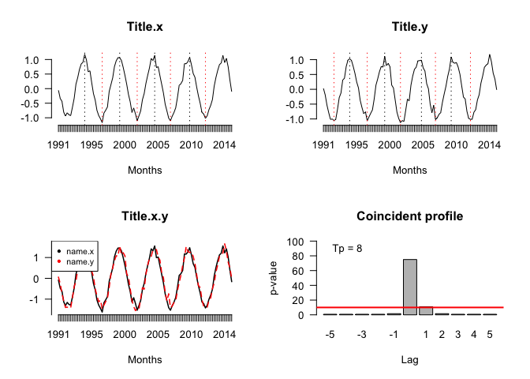

<!-- README.md is generated from README.Rmd. Please edit that file -->
Coinprofile
===========

This package allows us to calculate the turning points from the Bry and Boschan (1971) methodology. The main goal of Coinprofile is to build the coincident profile according to Martinez et al (2016).

Installation
------------

You can install the released version of Coinprofile from [CRAN](https://CRAN.R-project.org) with:

``` r
install.packages("Coinprofile")
```

Example
-------

This is a basic example which shows you how to solve a common problem:

``` r
library(Coinprofile)
## basic example code
set.seed(123)
w <- seq(-3, 7, length.out = 100)
x1 <- sin(pi*w)+rnorm(100,0,0.1)
x2 <- sin(pi*w-0.1)+rnorm(100,0,0.1)
coincident_profile(x1, x2, 4, 5, "name.x", "name.y", TRUE, 1991, 2015, 4, 4)
```



    #> $Profile
    #>        p.value lags
    #> p(-5)  0.78125   -5
    #> p(-4)  0.78125   -4
    #> p(-3)  0.78125   -3
    #> p(-2)  0.78125   -2
    #> p(-1)  1.56250   -1
    #> p(0)  75.00000    0
    #> p(1)  10.93750    1
    #> p(2)   1.56250    2
    #> p(3)   0.78125    3
    #> p(4)   0.78125    4
    #> p(5)   0.78125    5
    #> 
    #> $MainLag
    #>   lag_MaxP-value name.x name.y Amount_TP_used
    #> 1              0 name.x name.y              8

    # In this example x leads y three periods
    set.seed(123)
    w <- seq(-3, 7, length.out = 100)
    x <- sin(pi*w)+rnorm(100,0,0.1)
    y <- sin(pi*w-1)+rnorm(100,0,0.1)
    coincident_profile(x, y, 4, 6, "name.x", "name.y", TRUE, 1991, 2015, 4, 4)


    #> $Profile
    #>         p.value lags
    #> p(-6)   0.78125   -6
    #> p(-5)   0.78125   -5
    #> p(-4)   1.56250   -4
    #> p(-3) 100.00000   -3
    #> p(-2)   0.78125   -2
    #> p(-1)   0.78125   -1
    #> p(0)    0.78125    0
    #> p(1)    0.78125    1
    #> p(2)    0.78125    2
    #> p(3)    0.78125    3
    #> p(4)    0.78125    4
    #> p(5)    0.78125    5
    #> p(6)    0.78125    6
    #> 
    #> $MainLag
    #>   lag_MaxP-value name.x name.y Amount_TP_used
    #> 1             -3 name.x name.y              8
